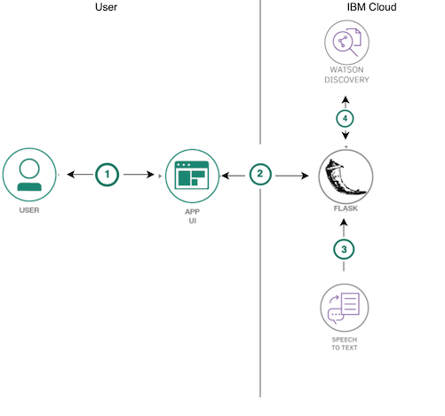
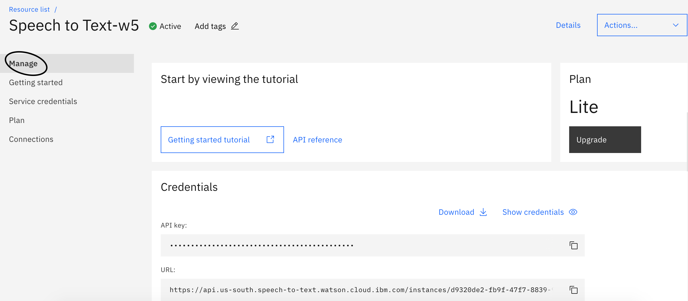
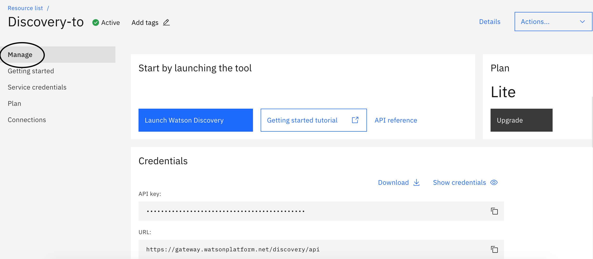
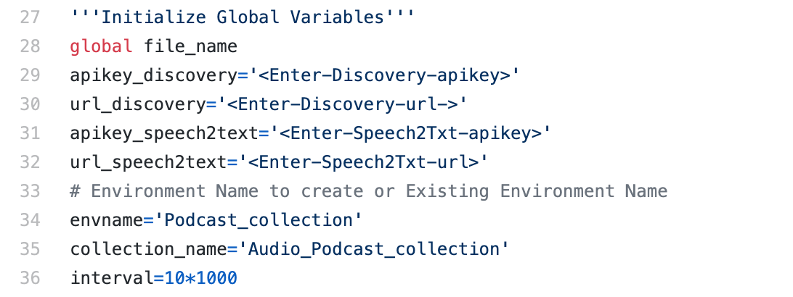
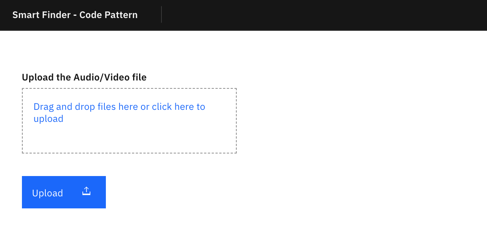
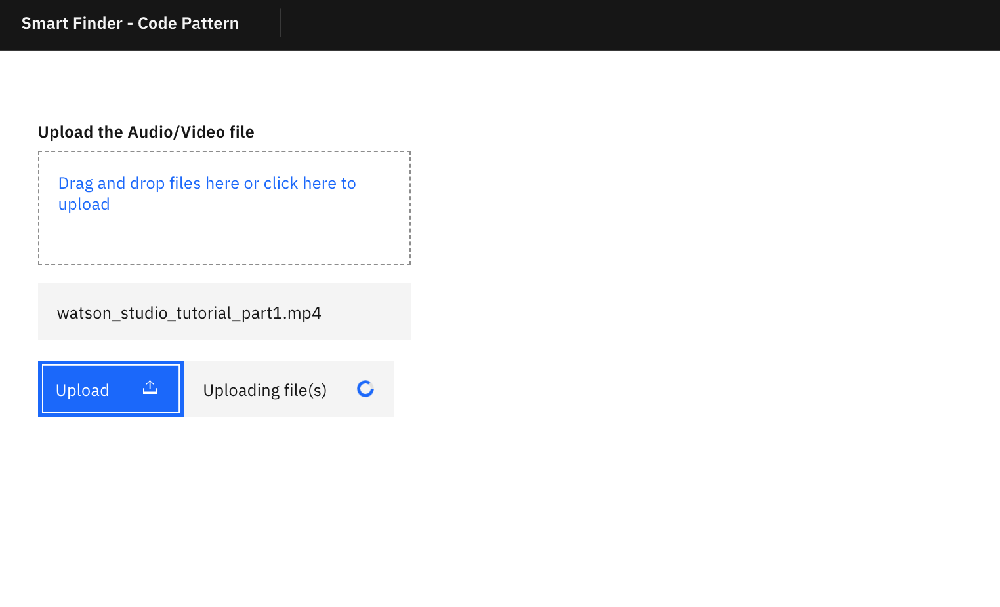
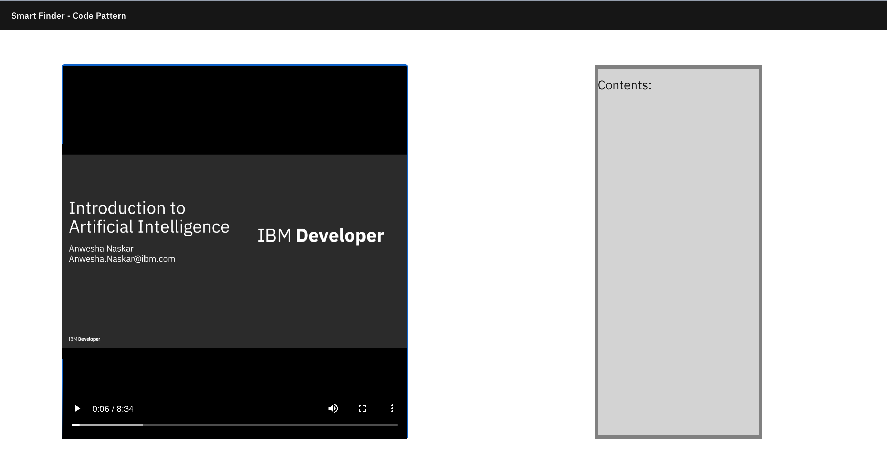
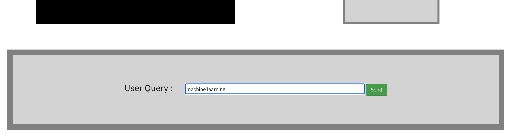
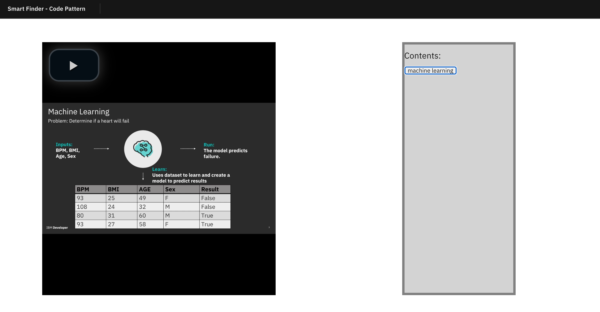
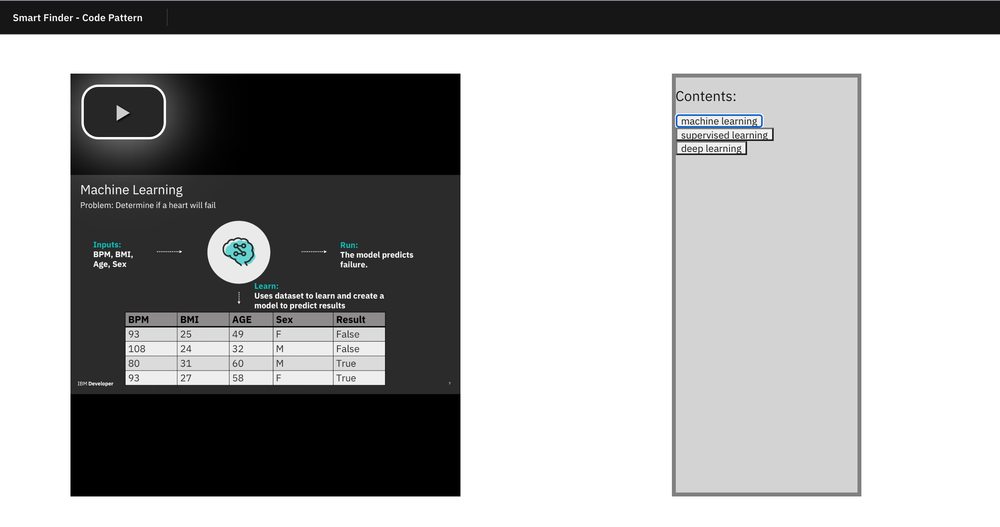

## Create a Python Flask Audio Search Application with Watson Speech to Text and Watson Discovery

Often while listening to a Podcast or probably listening to a course video/audio files, we might want to straight jump to the topic of our interest rather going through the entire recording again and again. But finding the topics and keywords in the entire recording could be challenging. 

In this code pattern, we will create an application with which you can search within the audio/video files. Not only search but it will highlight the part where `Search String/Topic` is occuring in the video/audio. This code pattern will perform  Natural language query search in audio files and get back with the results with the proper time frame where your search is being talked about.  

In this example, we will use a [Watson Machine Learning Introduction Video](https://github.com/IBM/audio_search_on_podcasts/blob/master/video/watson_studio_tutorial_part1.mp4) to illustrate the process.

When the reader has completed this code pattern, they will understand how to:

* Prepare audio/video data and perform chunking to break it into smaller chunks to work with.
* Work with the `Watson Speech to Text` service through API calls to convert audio/video to text.
* Work with the `Watson Discovery` service through API calls to perform search on text chunks.
* Create a python flask Application and deploy on IBM Cloud.



## Flow

1. The user uploads the video/audio file on the UI. 
1. The Audio/Video is processed with python libraries and perform chunking on them to convert it into smaller chunks to work with.
1. The user interacts with the Watson Speech to Text service via the provided application UI. The Audio chunks are converted into text chunks with Watson Speech to Text.
1. The text chunks are uploaded on Watson Discovery by calling Discovery APIs with python SDKs.
1. The user hit a search query using Discovery.
1. The results are shown on the UI .

## Included components

* [IBM Watson Speech to Text](https://www.ibm.com/watson/services/speech-to-text): easily convert audio and voice into written text for quick understanding of content.
* [IBM Watson Discovery](https://developer.ibm.com/articles/introduction-watson-discovery/):  IBM Watson Discovery, you can ingest, normalize, enrich, and search your unstructured data (JSON, HTML, PDF, Word, and more) with speed and accuracy.

## Featured technologies

* [Python Flask](https://flask.palletsprojects.com/en/1.1.x/): Flask is a lightweight WSGI web application framework. It is designed to make getting started quick and easy, with the ability to scale up to complex application.
* [IBM Watson Speech to Text](https://www.ibm.com/watson/services/speech-to-text): easily convert audio and voice into written text for quick understanding of content.
* [IBM Watson Discovery](https://developer.ibm.com/articles/introduction-watson-discovery/):  IBM Watson Discovery, you can ingest, normalize, enrich, and search your unstructured data (JSON, HTML, PDF, Word, and more) with speed and accuracy.


# Steps

1. [Clone the repo](#1-clone-the-repo)
1. [Create Speech to text service](#2-create-ibm-cloud-services)
1. [Create Watson Discovery](#3-create-ibm-cloud-services)
1. [Configure credentials](#4-configure-credentials)
1. [Run The Application Locally](#5-download-and-prepare-the-data)


## 1. Clone the repo
Clone the `audio_search_on_podcasts` repo locally. In a terminal, run:

```bash
git clone https://github.com/IBM/audio_search_on_podcasts/
```


## 2. Create Watson Speech To Text

Create the service:

* [**Watson Speech To Text**](https://cloud.ibm.com/catalog/services/speech-to-text)
- Click on the Watson Speech To Text. It will take to the Catalog on IBM Cloud. Just hit the `create` button.

> Note: In order to perform customization, you will need to select the `Standard` paid plan. But for this Code Pattern, you can work with the `LITE` Plan. 

From your **Watson Speech to Text** service instance, select the `Service Credentials` tab.

* Copy the credentials to authenticate to your service instance:
* On the Manage page, click Show Credentials to view your credentials.
* Copy the API Key and URL values  as they will be needed in future steps.



If no credentials exist, select the `New Credential` button to create a new set of credentials. Then save API Key and URL values.


## 3. Create Watson Discovery
Create the service:

* [**Watson Discovery**](https://cloud.ibm.com/catalog/services/discovery)
- Click on the Watson Discovery. It will take to the Catalog on IBM Cloud. Just hit the `create` button.

> Note: For this Code Pattern, you can work with the `LITE` Plan. 
service-credentials-discovery




If no credentials exist, select the `New Credential` button to create a new set of credentials. Then save API Key and URL values.

## 4. Run The Application Locally

### 4.1. Update global variables in app.py

In the repo parent folder, open `app.py` file.

  
  
* Enter `Discovery API Key` and `Discovery URL` saved from earlier steps in placeholder in the flask server code as shown above. You can find these in line numbers 29 and 30.
* Similarly, enter `Speech to Text API Key` and `Speech to Text URL` saved from earlier steps in placeholder in the flask server code as shown above. You can find these in line numbers 31 and 32.
* Enter the desired name for your Discovery Environment, or use your existing environment name. Update the variable `envname`. You can find this in line number 34.
* Enter the desired name for the Collection that will be created for this project. Update the variable `collection_name`. You can find this in line number 35.

> Note: When a user creates a Watson Discovery instance, he or she would have to create an Environment where your collections (the documents that form the basis for Discover query). For more details visit - https://cloud.ibm.com/docs/discovery?topic=discovery-getting-started

### 4.2. Install requirement.txt

* Open the Terminal on the cloned repo folder.
* Run the command

```python
pip install -r requirements.txt
```

### 4.3. Run the flask app

* Now run the below command

```python
python app.py
```

* The application will be listening on http://localhost:8080


# Sample output

Below are the steps to execute the application

* Download the video from this repo- https://github.com/IBM/audio_search_on_podcasts/blob/master/video/watson_studio_tutorial_part1.mp4

    

* Click on the Upload button and wait for 8-10 minutes for the video to complete processing and get results from the Watson Services

  

* Once the processing is done, you will receive an Intro Page, where user can enter a query as shown. 

      
  
* Now play the video and then navigate to the query box, and enter your desired search keyword. For our video we enter the following search key- `machine learning`.

  

* Wait for 20-30 seconds for a response and you will receive the searched key word on the Table of Contents section. On clicking on the keyword, in this case `machine learning`, the video will begin from the most relevant occurence of the desired topic.

    

* Similarly, you can repeat this process for other keywords, we have entered- `supervised learning` and `deep learning`. On the right side of the screen you can see all the previously searched keys as a table of contents. 

     


# Deploy on IBM Cloud

Instructions for deploying the web application on Cloud Foundry can be found [here](https://docs.cloudfoundry.org/devguide/deploy-apps/deploy-app.html).

# Learn more

* **Artificial Intelligence Code Patterns**: Enjoyed this Code Pattern? Check out our other [AI Code Patterns](https://developer.ibm.com/technologies/artificial-intelligence/)
* **AI and Data Code Pattern Playlist**: Bookmark our [playlist](https://www.youtube.com/playlist?list=PLzUbsvIyrNfknNewObx5N7uGZ5FKH0Fde) with all of our Code Pattern videos
* **With Watson**: Want to take your Watson app to the next level? Looking to utilize Watson Brand assets? [Join the With Watson program](https://www.ibm.com/watson/with-watson/) to leverage exclusive brand, marketing, and tech resources to amplify and accelerate your Watson embedded commercial solution.

# License

This code pattern is licensed under the Apache Software License, Version 2.  Separate third party code objects invoked within this code pattern are licensed by their respective providers pursuant to their own separate licenses. Contributions are subject to the [Developer Certificate of Origin, Version 1.1 (DCO)](https://developercertificate.org/) and the [Apache Software License, Version 2](https://www.apache.org/licenses/LICENSE-2.0.txt).

[Apache Software License (ASL) FAQ](https://www.apache.org/foundation/license-faq.html#WhatDoesItMEAN)
